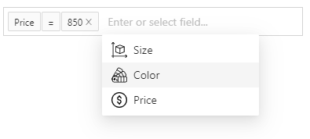

# React-Filter-Easy

Pretty and reusable filter box for React.

Currently filter component require [Antd design](https://www.npmjs.com/package/antd) as peer dependency, but in future it will be provided as self-contained component with zero dependencies. 

💅 - fully customizable;

🔥 - a lot of advanced functionality.



## Installation and usage

The easiest way to use react-filter-easy is to install it from npm and build it into your app with Webpack.
```
npm i react-filter-easy
```

Example of using:
```tsx
import React, { useState } from 'react';
import ReactFilterEasy from 'react-filter-easy';

const fields = [{
  label: 'Field #1',
  name: 'field-1',
  valueEditor: {
    component: <input type="text"/>,
  },
}, {
  label: 'Field #2',
  name: 'field-2',
  availableOperators: ['more', 'less'],
  valueEditor: {
    component: <input type="number"/>,
  },
}];

export default function App() {
  const [conditions, setConditions] = useState([]);

  return (
    <div className="App">
      <ReactFilterEasy
        fields={fields}
        conditions={conditions}
        onChange={setConditions}
      />
    </div>
  );
}
```

## Props

Common props of filter component:
* `className` - apply a className to the control;
* `styles` - apply styles to the control;
* `theme` - customize theme of control;
* `placeholders` - customize placeholders;
* `fields` - fields available for creating new conditions;
* `loading` - control loading state of control;
* `operators` - customize available operators;
* `conditions` - set showing conditions;
* `onChange` - subscribe to change events.
